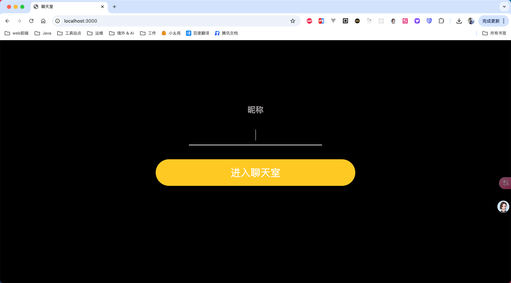
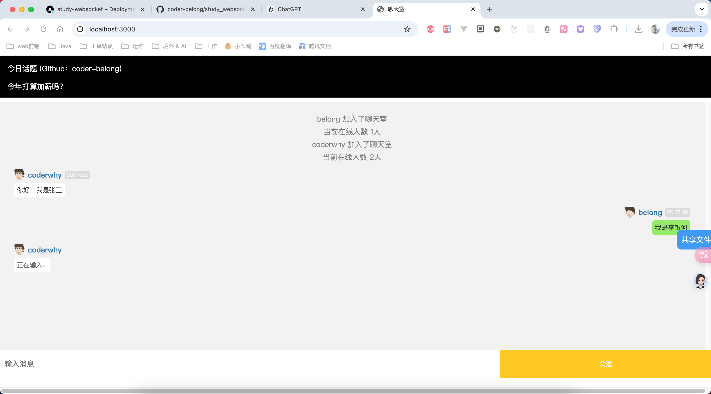
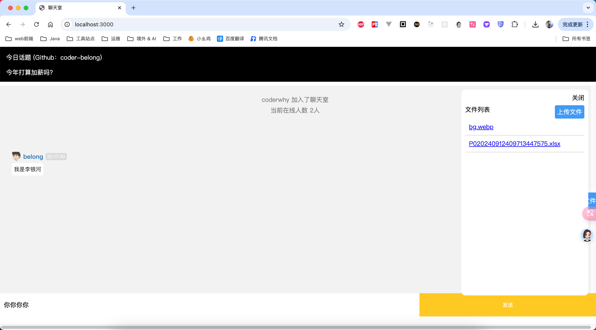

# 🌟 多人聊天室 🎉

一个用 **Node.js**、**Express**、**Socket.IO** 和 **Multer** 打造的实时多人聊天室应用 ✨。这个项目支持多用户实时聊天、输入状态提示，还可以进行文件分享哦 📁。

## 🌈 功能亮点

- **💬 实时消息**：随时随地即时发送和接收消息，聊天就是这么畅快！🗣️
- **✍️ 输入状态提示**：当用户正在输入时，会显示正在输入的状态，悄悄告诉大家“有人要发言啦！”⏳
- **📎 文件分享**：轻松上传和分享文件，和大家一起分享资源！📄
- **👥 用户管理**：用户加入、退出聊天室时都会有通知哦~ 想看看谁在线？小窗全知道！📲


进入聊天室



聊天室



文件共享




## 📁 项目结构

```bash
├── middleware          # 🛠️ 中间件（如文件清理）
│   └── fileCleanup.js  # 🧹 定时清理上传文件
├── public              # 🌐 前端页面和静态资源
│   └── index.html      # 💻 聊天界面
├── uploads             # 🗂️ 上传的文件存放目录
├── routes              # 🌍 路由
│   └── fileRoutes.js   # 📤 处理文件上传的路由
├── socketHandlers      # 🚦 Socket.IO 处理程序
│   ├── typing.js       # ✍️ 处理用户输入状态
│   └── message.js      # 💬 处理消息传递
├── fileUpload.js       # 📂 文件上传配置
├── app.js           # 🌟 服务器入口文件
└── README.md           # 📖 项目说明文档
```

## 🛠️ 安装指南

1. **克隆项目到本地** 🖥️：

   ```bash
   git clone https://github.com/coder-belong/study_websocket.git
   ```

2. **安装依赖** 🚀：

   ```bash
   cd study_websocket
   npm install
   ```

3. **启动服务器** 🔥：

   ```bash
   npm start
   ```

4. **打开浏览器** 🌐，访问 `http://localhost:3000`，开始愉快的聊天吧！💬🎉

## 📤 文件上传说明

- 点击“上传文件”按钮📂，选择你想分享的文件，一键上传成功 ✅！上传的文件会自动显示在聊天记录里，大家都能看到哦 👀~
- 文件会保存在 `uploads` 文件夹中，并且每天自动清空✨，不用担心存太多文件啦！

## 🛠️ 技术栈

- **后端**: Node.js, Express, Socket.IO 🚀
- **前端**: HTML, CSS, JavaScript 💻
- **文件上传**: Multer 📂
- **定时清理**: Node.js `fs` 模块定时任务 🧹

------

💡 **Tip**：这个聊天室不仅能发消息，还能发文件，赶紧邀请朋友们一起来嗨聊吧！💬💖